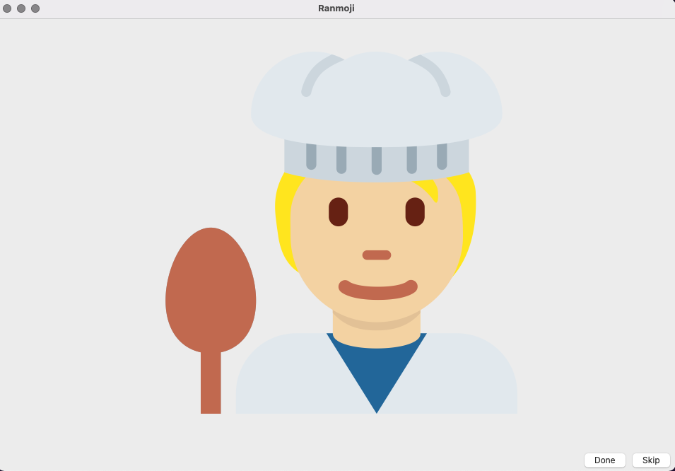

# ranmoji

Choose a random emoji from Twitter's emoji corpus. Written in C++ with QT.

## Releases
Check out the latest stable release on the [releases page](https://github.com/gnerkus/art-prompt/releases).

Currently only an Intel macOS build. Windows, Linux and Raspberry Pi 4 builds are in the works.
